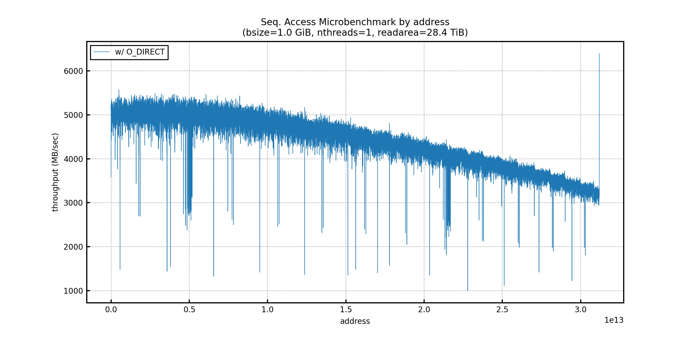
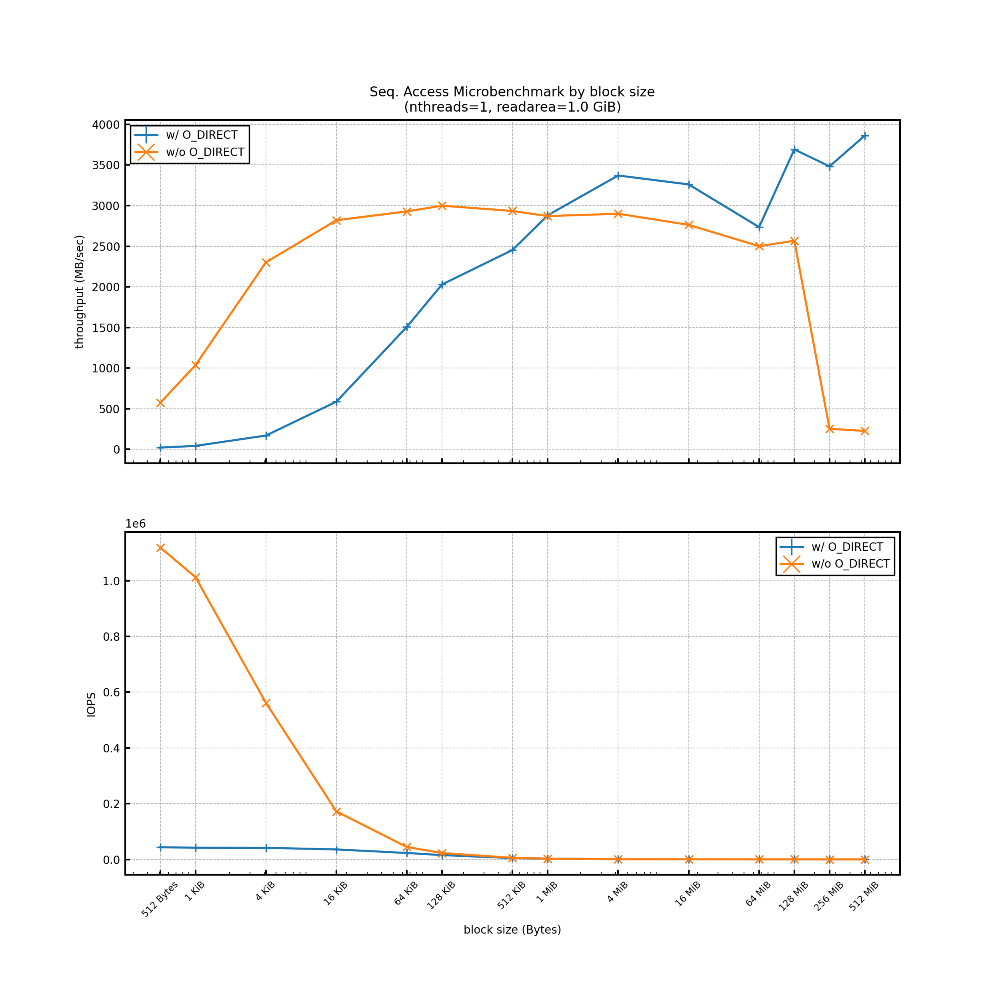
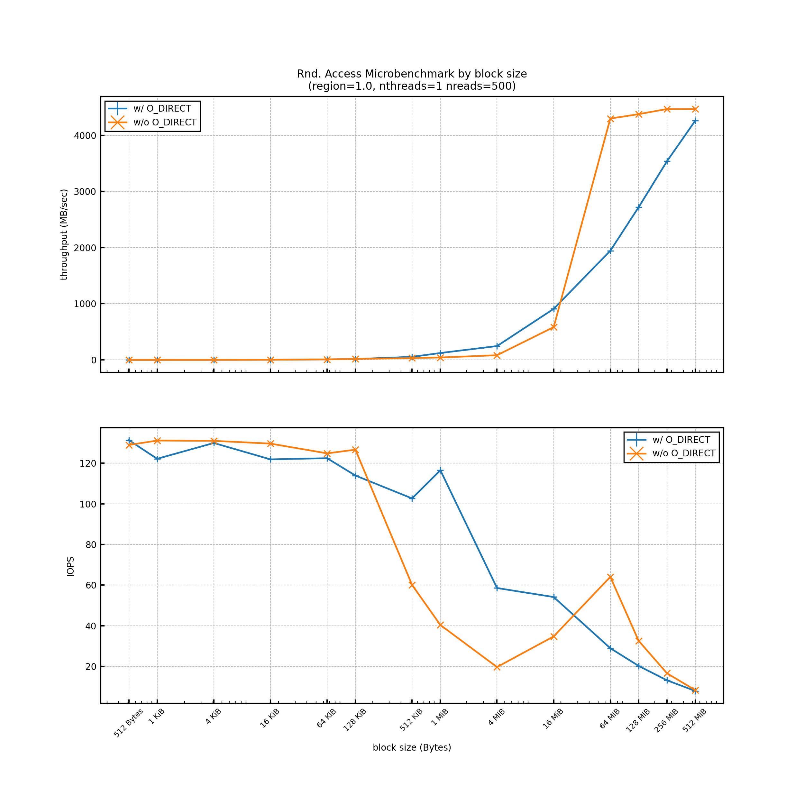
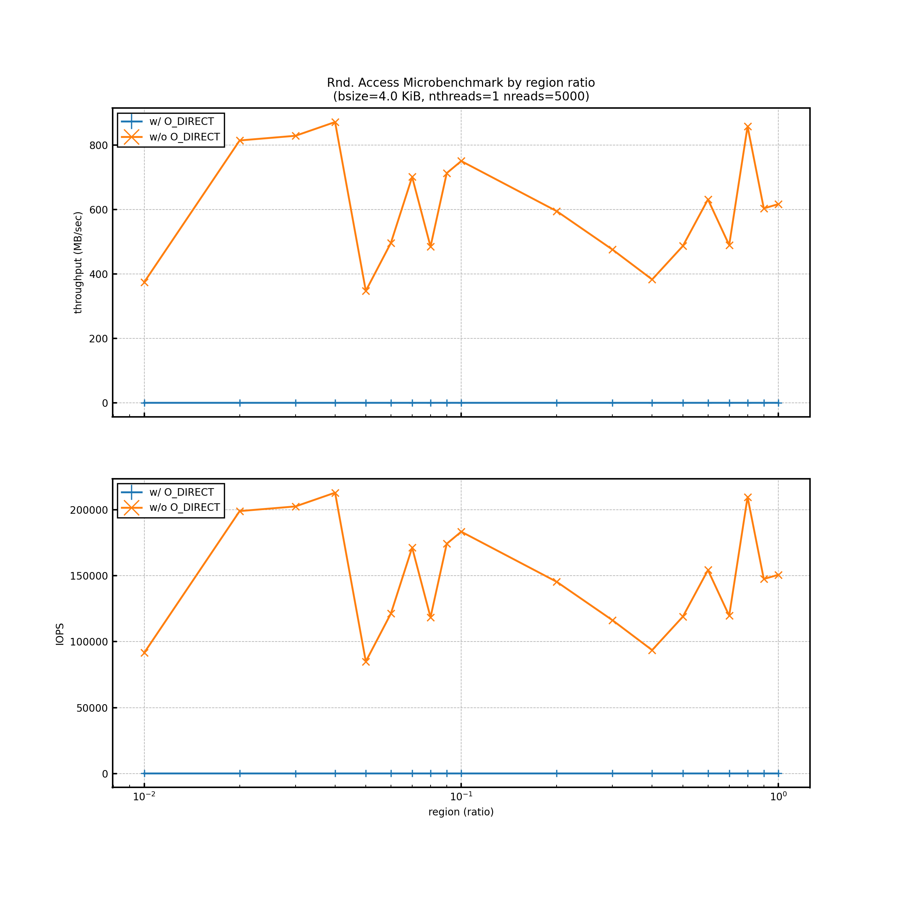
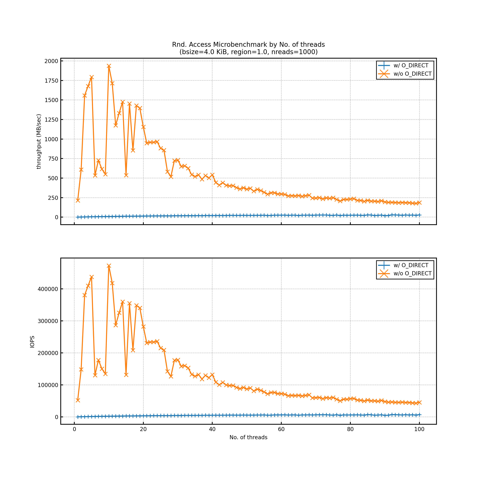
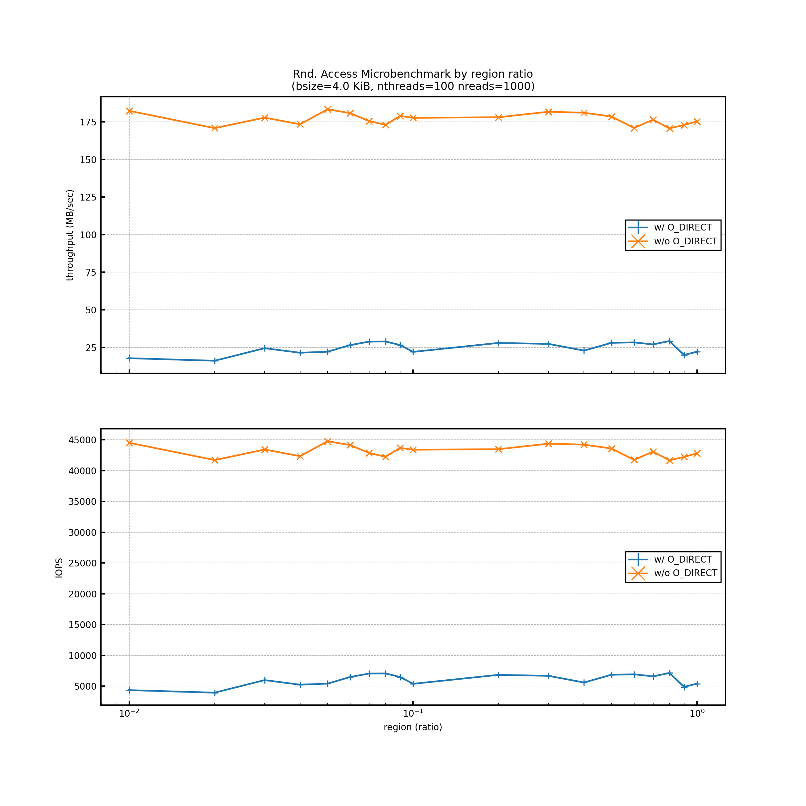

# Experiment Report 01
---
Found a bug in random access of Disker at the time of measuring

## Env
```
[Server Info]
kugenuma26

[Kernel Info]
3.10.0-1127.el7.x86_64

[CPU Info]
Model name:            Intel(R) Xeon(R) Gold 6132 CPU @ 2.60GHz
NUMA node(s):          2
Socket(s):             2
Core(s) per socket:    14
Thread(s) per core:    2
CPU(s):                56

[Memory Info]
93.0258 GB

[Storage Info]
/dev/sdb1
                configuration: ansiversion=5 guid=cd508024-9ebb-419b-ba9d-a6fbb2a7387a logicalsectorsize=512 sectorsize=512
              *-volume
                   description: data partition
                   vendor: Windows
                   physical id: 1
                   bus info: scsi@0:2.1.0,1
                   logical name: /dev/sdb1
                   logical name: /export/data1
                   serial: 770eaa2b-bd19-414a-ae48-58acb14ad49d
                   capacity: 28TiB
                   configuration: mount.fstype=xfs mount.options=rw,relatime,attr2,inode64,logbsize=256k,sunit=512,swidth=2048,noquota state=mounted
     *-generic:70 UNCLAIMED
          description: System peripheral

[RAID Info]
Host: scsi0 Channel: 02 Id: 00 Lun: 00
  Vendor: DELL     Model: PERC H740P Mini  Rev: 5.09
  Type:   Direct-Access                    ANSI  SCSI revision: 05
```

## Results
### Seq.
#### by address


#### by block size


### ~~Rand.~~
#### ~~by block size~~


#### ~~by region ratio~~


#### ~~by No. of threads~~


#### ~~by region ratio in 100 threads~~

