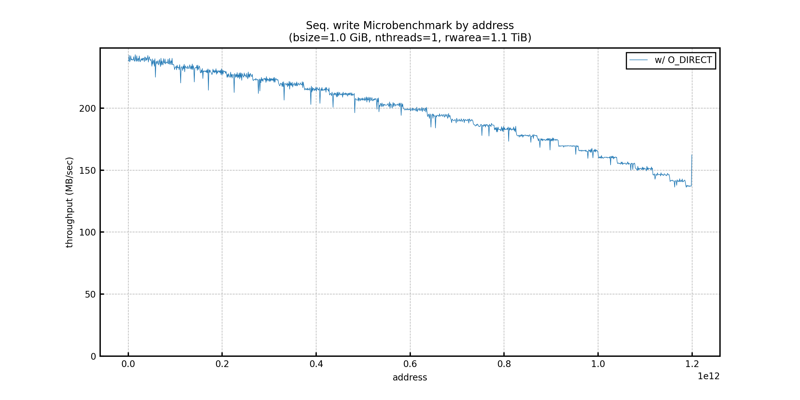
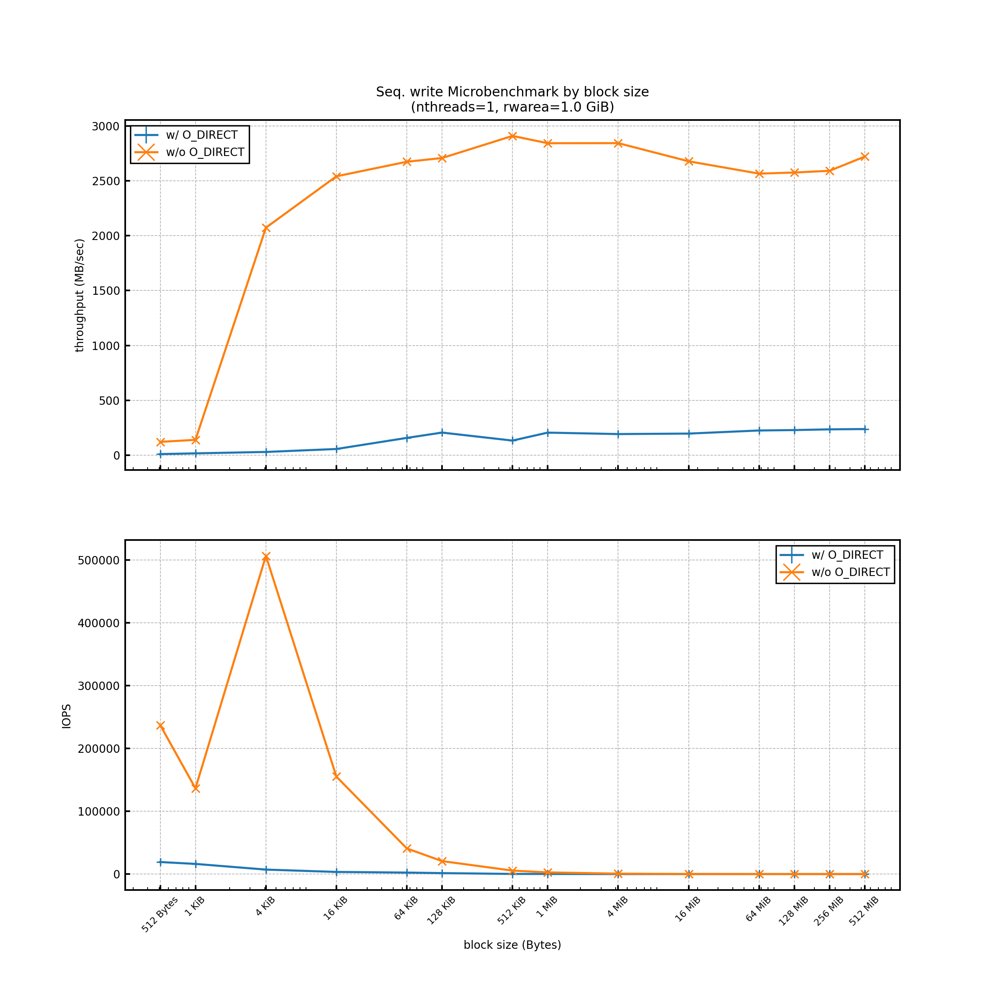
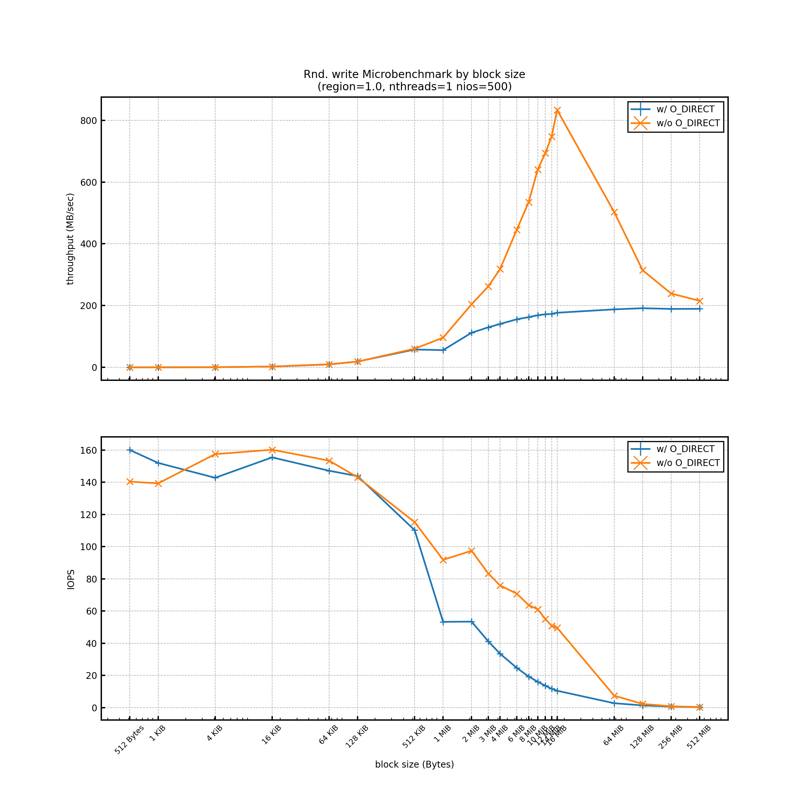
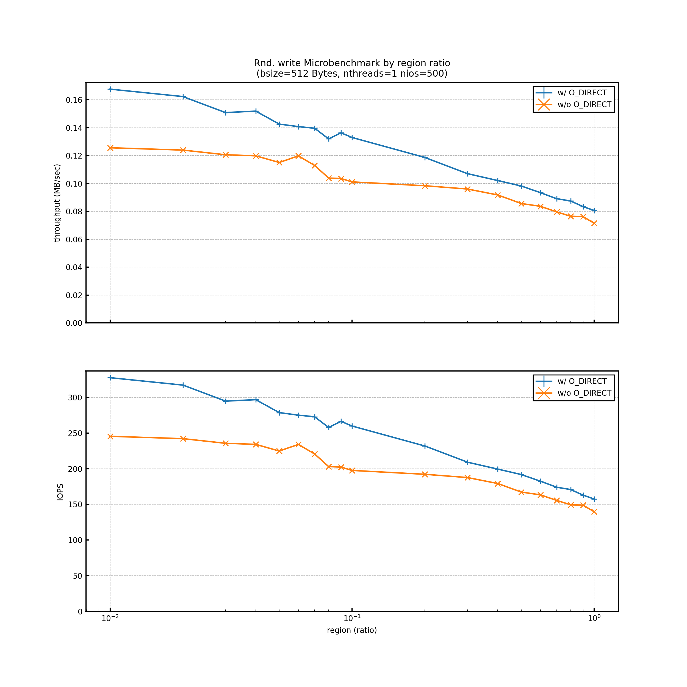
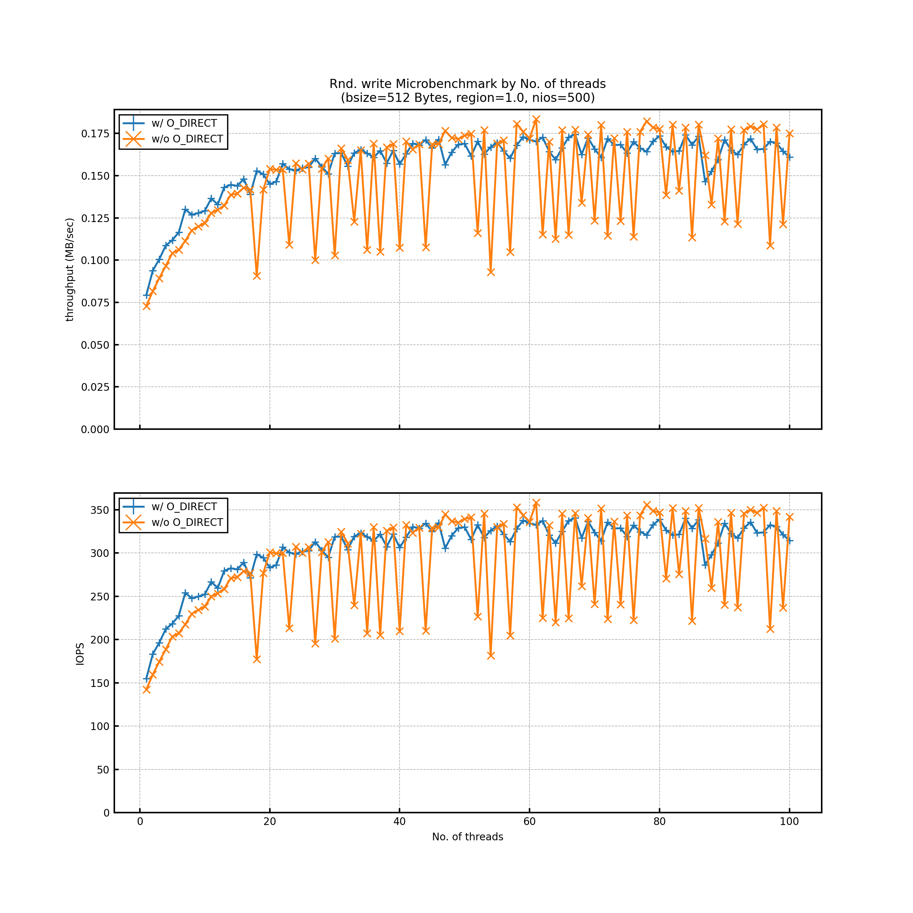
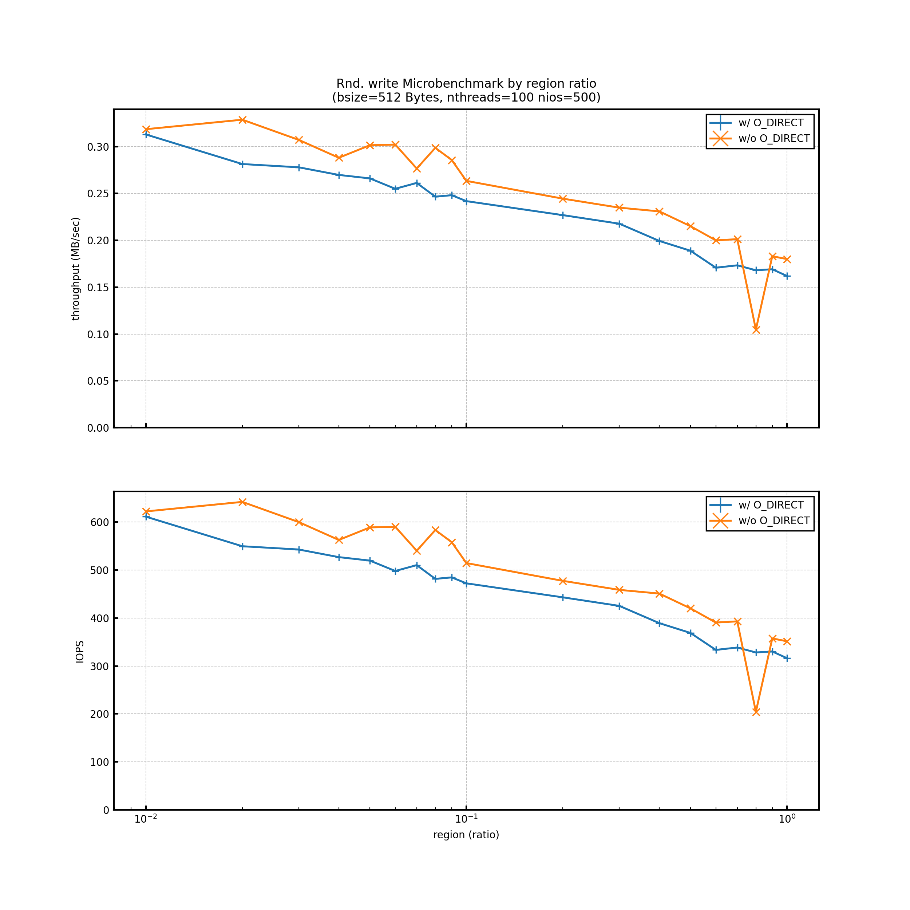

# Experiment Report 03 (2020/08/19)
---

## Objective
Deeper understanding of disks characteristic by measuring approach (not for just knowing disk performance)

## Env
```
[Server Info]
kugenuma29

[Kernel Info]
4.18.0-193.14.2.el8_2.x86_64

[CPU Info]
Model name:          Intel(R) Xeon(R) Gold 6132 CPU @ 2.60GHz
NUMA node(s):        2
Socket(s):           2
Core(s) per socket:  14
Thread(s) per core:  2
CPU(s):              56

[Memory Info]
93.0435 GB

[Storage Info]
/dev/sdb
           *-disk:1
                description: SCSI Disk
                product: AL15SEB120NY
                vendor: TOSHIBA
                physical id: 2.1.0
                bus info: scsi@0:2.1.0
                logical name: /dev/sdb
                version: EF06
                serial: 58U0A1UUFQVF
                size: 1117GiB (1200GB)
                capacity: 1835GiB (1971GB)
                capabilities: 10000rpm
                configuration: ansiversion=6 logicalsectorsize=512 sectorsize=512
```

## Experiment settings
- Measureing trail is only once on each experiment condition.
    - Because flucutation of the results are confirmed that their margins of errors are within plus/minus 10 percent by 3 times test trials before each acutual measuring.
- Not doing something like `fsync()` after `write()`

## Results
`w/ O_DIRECT` showed nearly raw HDD performance. On the other hand, `w/o O_DIRECT` would use buffering quite much, so the result depends on OS buffer flushing.

### Seq. Write
#### by address
The throughput gets step-wise lower, as an address gets larger. This is caused by `Zone Bit Recording` of HDD.


#### by block size


### Rand. Write
#### by block size


#### by region ratio
When the area you access is a small portion of HDD space, the ratio of cache-hit gets higher and then the performance gets better.


#### by No. of threads
Concurrent Multi threads accesses are scheduled out-of-order wise by HDD Controller, which lessen extra rotation of disks.


#### by region ratio in 100 threads
The effect of cache still works even in a multi-threads situation.

