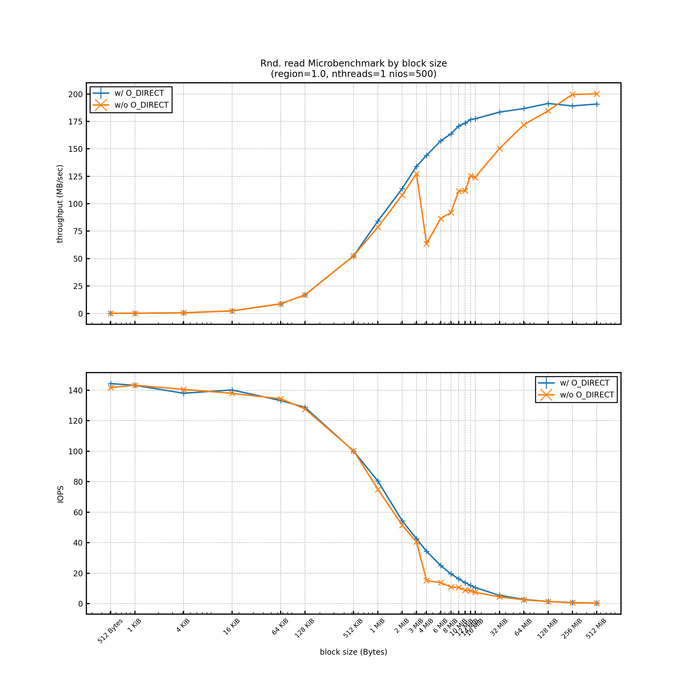

# Experiment Report 05 (2020/08/21)
---

## Objective
To check whether there is a difference in terms of performance between `malloc()` vs `posix_memalign()` when w/o `O_DIRECT`

## Env
```
[Server Info]
kugenuma29

[Kernel Info]
4.18.0-193.14.2.el8_2.x86_64

[CPU Info]
Model name:          Intel(R) Xeon(R) Gold 6132 CPU @ 2.60GHz
NUMA node(s):        2
Socket(s):           2
Core(s) per socket:  14
Thread(s) per core:  2
CPU(s):              56

[Memory Info]
93.0435 GB

[Storage Info]
/dev/sdb
           *-disk:1
                description: SCSI Disk
                product: AL15SEB120NY
                vendor: TOSHIBA
                physical id: 2.1.0
                bus info: scsi@0:2.1.0
                logical name: /dev/sdb
                version: EF06
                serial: 58U0A1UUFQVF
                size: 1117GiB (1200GB)
                capacity: 1835GiB (1971GB)
                capabilities: 10000rpm
                configuration: ansiversion=6 logicalsectorsize=512 sectorsize=512
```

## Experiment settings
- The number of trials is just one on each bsize (x-point).

## Results
### Rnd. read by block size
#### Using `malloc()` for buffer
- Disker version : 1c02477fe5e1583a8b6abbf33eb87b16b1e4cbcf


#### Using `posix_memalign()` for buffer (all the previous recent experiments)
- This image is from report04.


## Conclusion
There is no difference.
