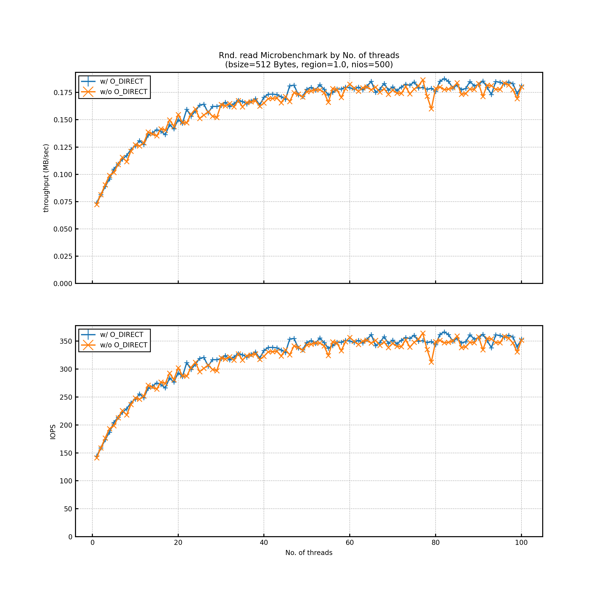
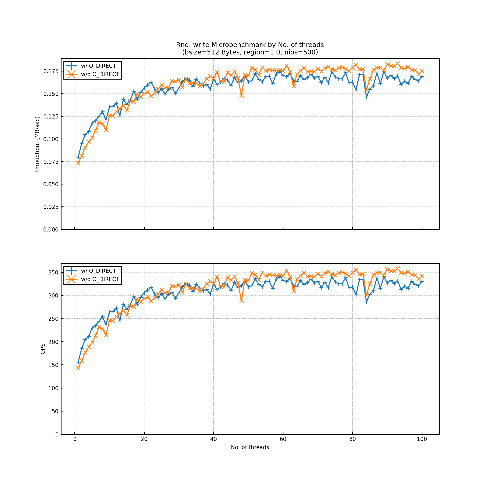
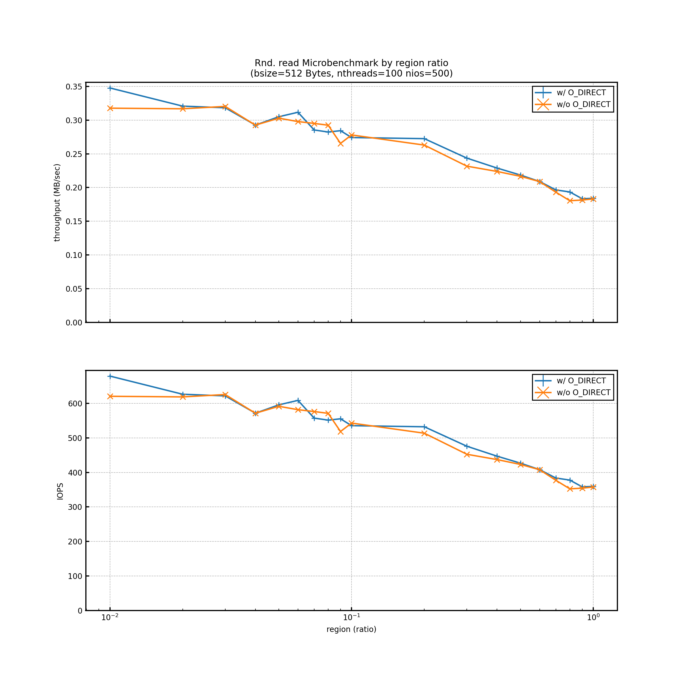
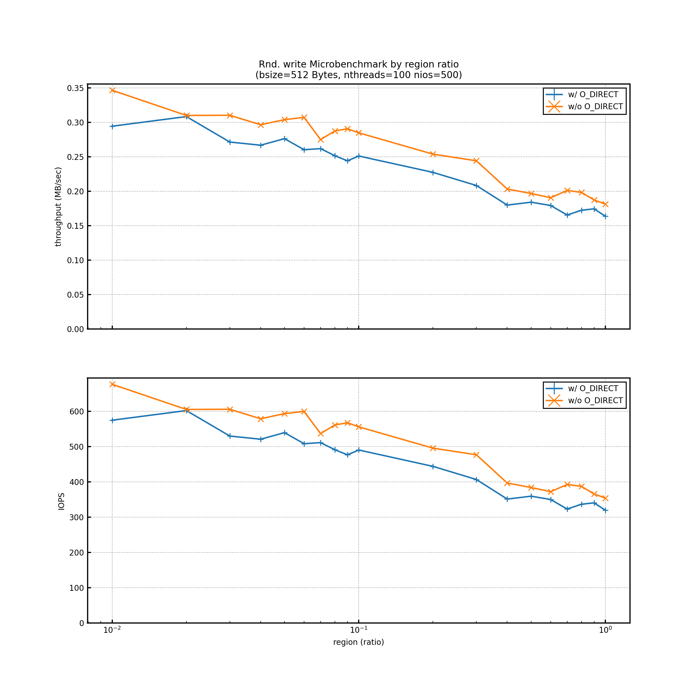

# Experiment Report 07 (2020/08/22)
---

## Objective
It has been founded that there was a bug in multi-threads randomer used in report01-06.
So, in this experiment, I will try re-measure with bug-fixed Disker.

## Env
```
[Server Info]
kugenuma29

[Kernel Info]
4.18.0-193.14.2.el8_2.x86_64

[CPU Info]
Model name:          Intel(R) Xeon(R) Gold 6132 CPU @ 2.60GHz
NUMA node(s):        2
Socket(s):           2
Core(s) per socket:  14
Thread(s) per core:  2
CPU(s):              56

[Memory Info]
93.0435 GB

[Storage Info]
/dev/sdb
           *-disk:1
                description: SCSI Disk
                product: AL15SEB120NY
                vendor: TOSHIBA
                physical id: 2.1.0
                bus info: scsi@0:2.1.0
                logical name: /dev/sdb
                version: EF06
                serial: 58U0A1UUFQVF
                size: 1117GiB (1200GB)
                capacity: 1835GiB (1971GB)
                capabilities: 10000rpm
                configuration: ansiversion=6 logicalsectorsize=512 sectorsize=512
```

## Experiment settings
- Disker version: 823ae78bc4faaa073daa5de288375a59b01930d8
- Measuring trail is only once on each experiment condition.
    - Because fluctuation of the results are confirmed that their margins of errors are within plus/minus 10 percent by 3 times test trials before each actual measuring.
- did test on both read/write
- The results which use a multi-threads function would have the possibility to change compared to ones in previous reports, because I fixed the bug about multi-threads.

## Results
### Rnd. Access
#### by No. of threads

The result is the same to one which has a bug in previous reports. I assume this is because rnd. read() is IO-bound which means `gNios--` is rarely executed in a each thread. Therefore, there are few conflicts on `gNios` between threads and the bug virtually has no effect on the result.


In previous reports, it dynamically  swinged w/o O_DIRECT. But this time, the phenomena didn't show up. So the swing reason would be due to the `gNios` bug. But there still be a mystery that why the bug caused the swing and didn't during read() measurement.

#### by region ratio in 100 threads


